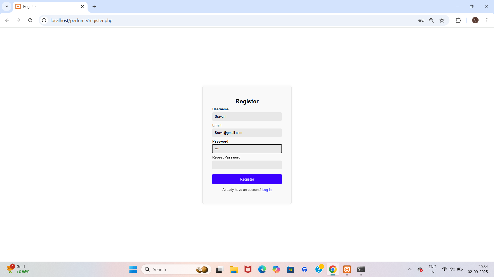
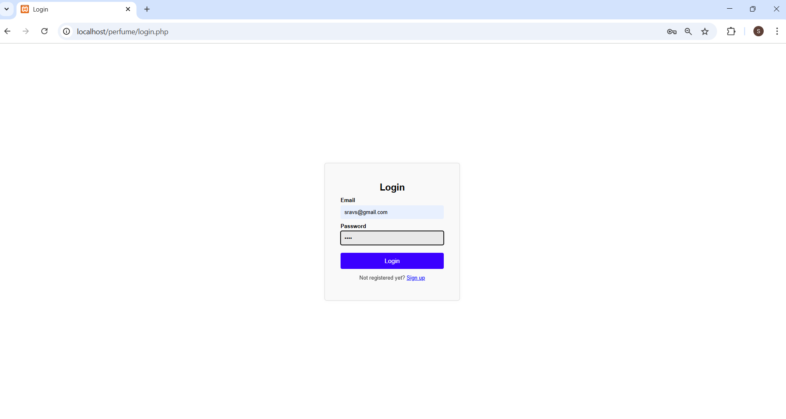
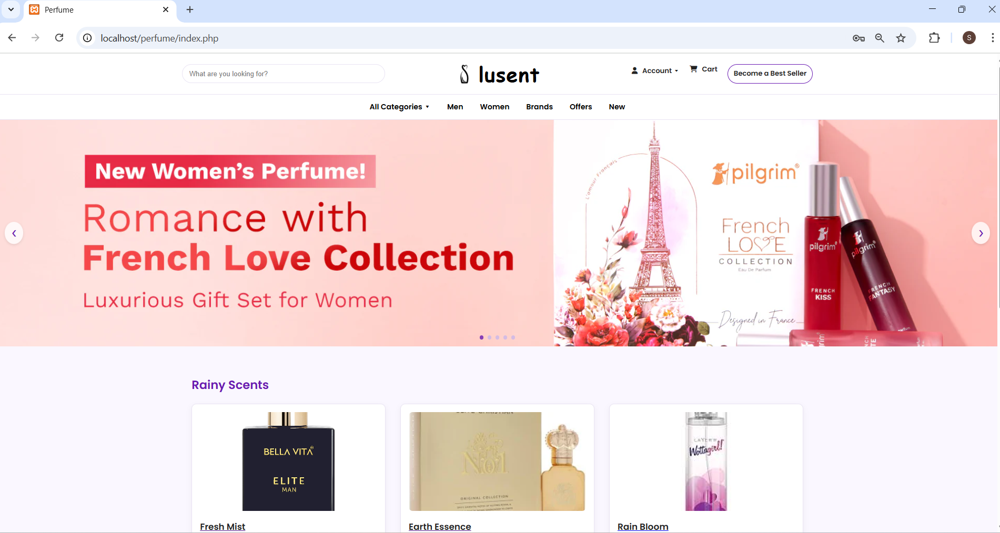
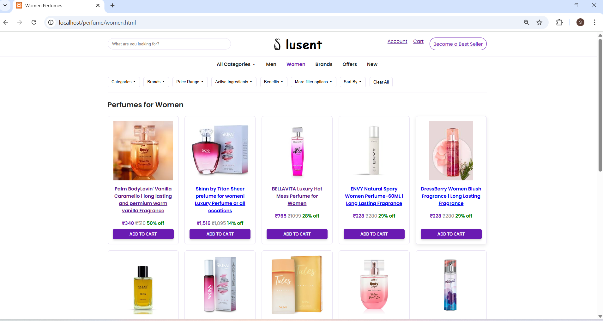
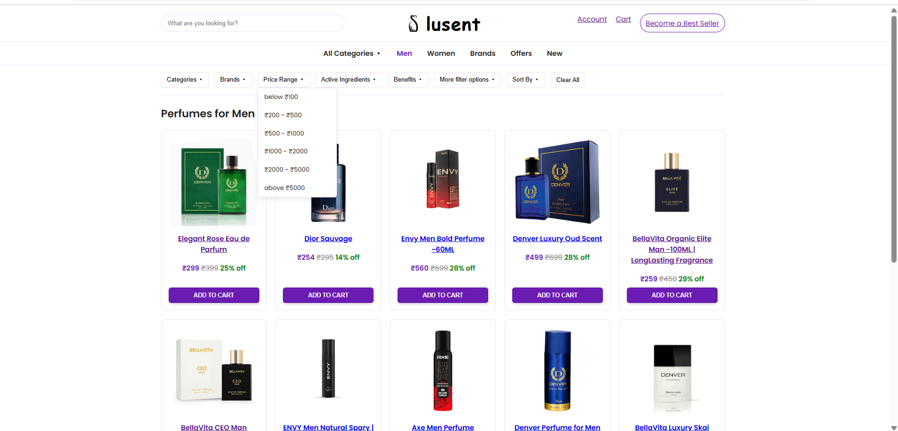
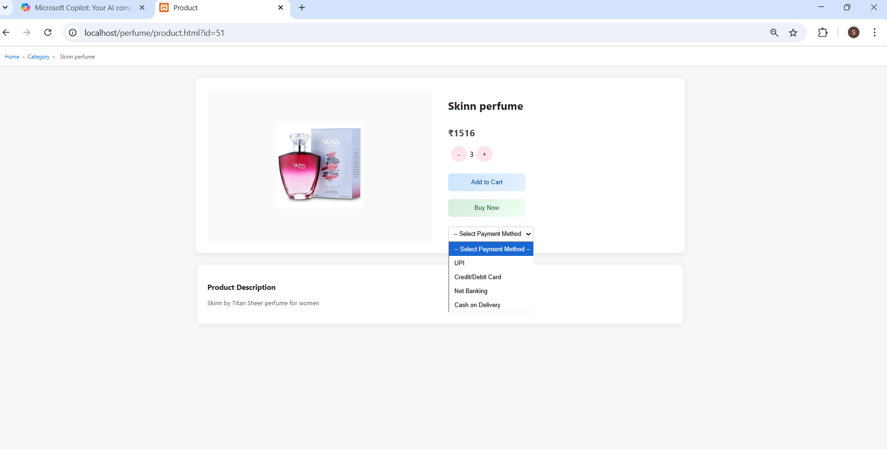
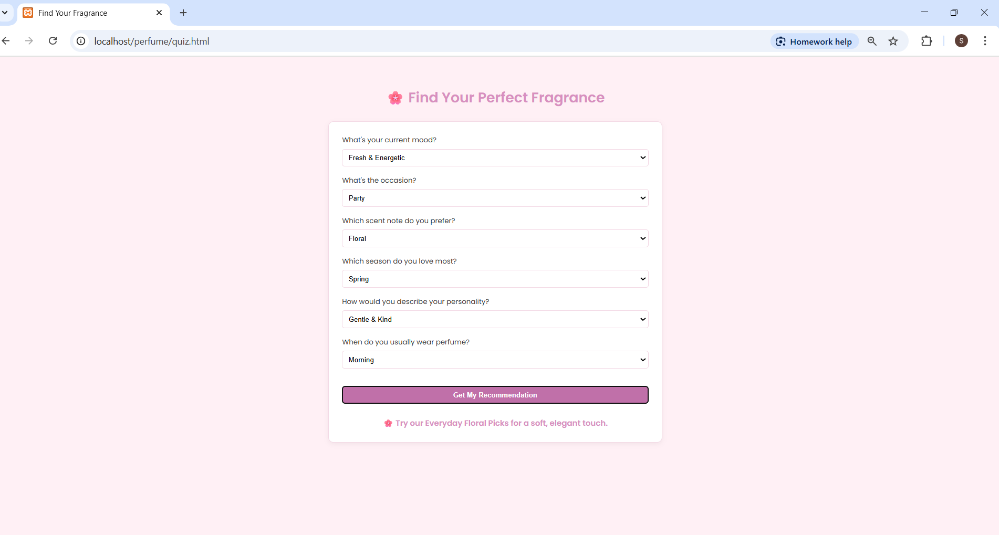
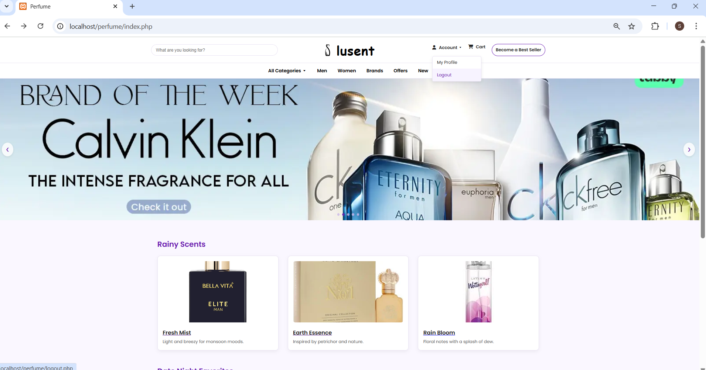

#  Lusent Perfume Website
Lusent is a full-stack perfume e-commerce platform built with PHP, HTML, CSS, and JavaScript. It features user authentication, dynamic product pages, category filtering, and a fragrance quiz to help users find their perfect scent.
##  Features
- User Registration & Login (PHP + MySQL)
- Secure session-based authentication
- Dynamic product detail pages with quantity and payment options
- Category filtering: Men, Women, Offers, Brands, New
- Fragrance Finder Quiz
- Responsive design with elegant UI
##  Tech Stack
- **Frontend:** HTML, CSS (Poppins + Font Awesome), JavaScript
- **Backend:** PHP (XAMPP)
- **Database:** MySQL (via phpMyAdmin)
- **Hosting (Local):** XAMPP
- **Version Control:** Git + GitHub
<pre><code> Folder Structure
perfume/
├── index.php
├── login.php / register.php / logout.php
├── product.html / quiz.html / men.html / women.html / brands.html / offers.html / new.html /
├── css/ (dashboard.css,men.css,styles.css,women.css)
├── js/ (dashboard.js, products.js,brand.js,men.js,women.js)
├── images/ (product images)
</code></pre>
##  How to Run Locally

To run the Lusent perfume website on your local machine using XAMPP, follow these steps:

1. **Clone the repository**
   ```bash
   git clone https://github.com/Sravanip2165/Perfume_Website.git
Move the project folder to XAMPP's htdocs directory

**Move the project folder to XAMPP's htdocs directory**
Navigate to the cloned folder

Copy or move it to - C:/xampp/htdocs/perfume

**Start XAMPP services**

Open the **XAMPP Control Panel**

Start the following modules:

     - Apache
     
     - MySQL
     
**Set up the database using phpMyAdmin**

Open your browser and go to:  http://localhost/phpmyadmin

Create a new database (e.g., lusent)

Import your .sql file if you have one:

Click Import

Choose your SQL file

Click Go

**Launch the website**

Open your browser and visit:

             http://localhost/perfume/register.php

**Register a new user account** and explore the website.

**Logout**

Use the Account dropdown in the top navigation bar

Click Logout to end the session and return to the login page

##  Screenshots

###  Register Page


###  Login


###  Home Page


###  womens Category


### Mens Category


### Filters on Brands Category


### Product Details


###  Fragrance Quiz


### Logout



